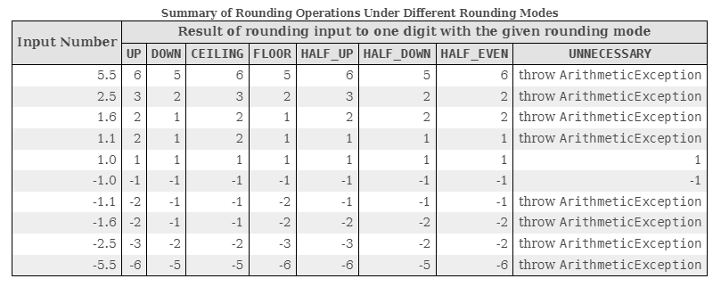

# Topp Tiny Concurrent Library

Module: `topp-tiny-concurrent-utility`

## Description

Topp Tiny Concurrent is an open-source Java library which implements concurrency related utilities.

## Content

Currently, addressed is the handling of
[time units](src/main/java/com/yelstream/topp/util/concurrent).
This explicitly addresses all roundings modes listed for [RoundingMode](https://docs.oracle.com/en/java/javase/17/docs/api/java.base/java/math/RoundingMode.html)
for [TimeUnit](https://docs.oracle.com/en/java/javase/17/docs/api/java.base/java/util/concurrent/TimeUnit.html).

This may address
[ChronoUnit](https://docs.oracle.com/en/java/javase/17/docs/api/java.base/java/time/temporal/ChronoUnit.html).
at a later time.

 

## Artifacts

Artifacts are released to the [Maven Central Repository](https://search.maven.org/).

For the latest version,
search
[_Group ID_ `io.github.sabroe.topp` and _Artifact ID_ `topp-tiny-concurrency-utility`](https://search.maven.org/search?q=g:io.github.sabroe.topp%20AND%20a:topp-tiny-concurrency-utility).

---

_Greetings to all, Morten Sabroe Mortensen_

